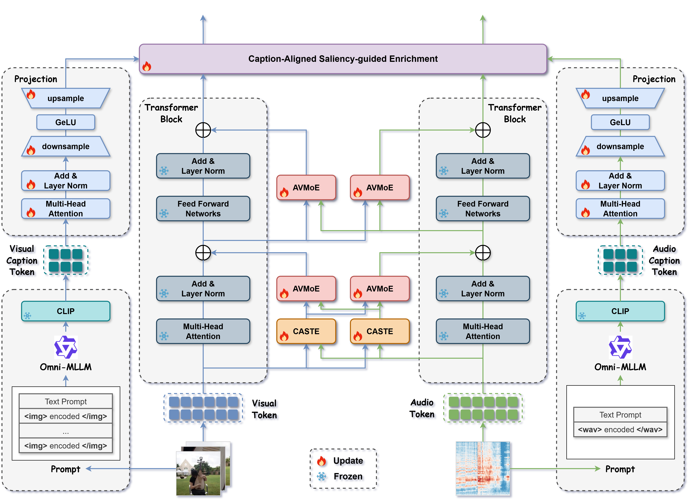

# CAE-AV: Improving Audio-Visual Learning via Cross-modal Interactive Enrichment

This repository is the official implementation of our paper "CAE-AV: Improving Audio-Visual Learning via Cross-modal Interactive Enrichment".




*Method Overview*


---

### Requirements and Installation

- **Getting start**

  ```bash
  pip install -r requirements.txt
  ```

- **Download dataset**

  Todo: We will provide the complete dataset after the paper is accepted, and the annotated files can currently be viewed under `./data`.

- **Download pretrained backbones**

  Todo: We will provide the complete pretrained backbones after the paper is accepted.

---

### Codes

Our code is based on [AVMoE]([yingchengy/AVMOE: [NeurIPS 2024\] Mixture of Experts for Audio-Visual Learning](https://github.com/yingchengy/AVMOE)).

The models corresponding to the downstream tasks have been placed in the respective folders, specifically in `./CAE-AV/AVE/nets`, `./CAE-AV/AVQA/net_grd_avst`, `./CAE-AV/AVS/avs_scripts`, and `./CAE-AV/AVVP/nets`.

We will provide the complete training code after the paper is accepted.
